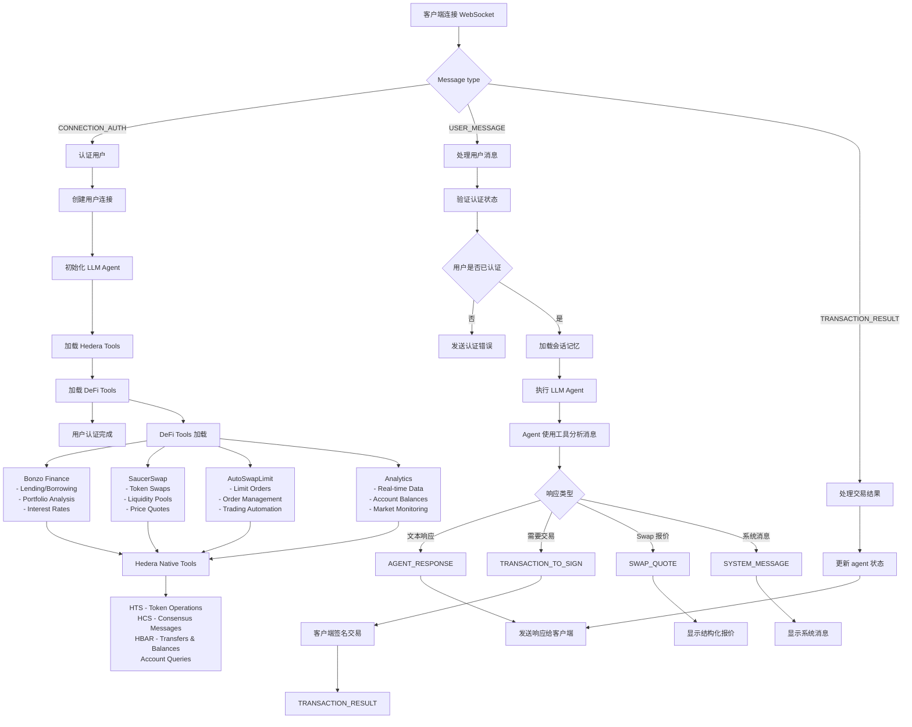

# Hedera DeFi AI Agent

## 相关仓库

- **Frontend**: [Hedron Frontend](https://github.com/rofergon/Hedron_Frontend) - Hedera DeFi AI Agent 的前端界面
- **AutoSwapLimit Contract**: [AutomationSwapLimit](https://github.com/rofergon/AutomationSwapLimit) - 用于限价单的中间合约

## 已部署合约

- **MockPriceOracle**: [0.0.6506125](https://hashscan.io/testnet/contract/0.0.6506125)
- **AutoSwapLimit**: [0.0.6506134](https://hashscan.io/testnet/contract/0.0.6506134)

## 项目说明

Hedera DeFi AI Agent 是一个专注于 Hedera Hashgraph DeFi 生态的人工智能代理。它通过集成 SaucerSwap DEX 操作、Bonzo Finance 借贷协议和 AutoSwapLimit 高级交易策略，帮助新手和有经验的用户理解、比较并优化 DeFi 操作。Agent 支持实时分析、自然语言交互和需要用户签名的自动化执行流程。

## 快速导航

| 快速导航 | 路径 | 说明 |
|---------|------|------|
| **DeFi Tools** | [typescript/src/shared/tools/defi/](typescript/src/shared/tools/defi/) | 完整 DeFi 工具集 |
| **WebSocket Agent** | [typescript/examples/langchain/websocket-agent.ts](typescript/examples/langchain/websocket-agent.ts) | 主 AI agent 服务 |
| **Message Handlers** | [typescript/examples/langchain/handlers/](typescript/examples/langchain/handlers/) | WebSocket 消息处理 |

## 解决的问题

### 面向新手用户

- **DeFi 生态复杂**：协议和选项数量多，用户很难判断从哪里开始。
- **技术知识门槛高**：流动性挖矿、收益 farming、借贷、staking 等概念不容易理解。
- **亏损风险**：在缺少足够信息时做投资决策，可能造成明显损失。
- **信息碎片化**：数据分散在多个平台，缺少统一视图。

### 面向有经验的用户

- **手动监控低效**：反复查看多个协议会消耗大量时间。
- **机会容易错过**：更好的套利、收益和限价策略可能被忽略。
- **比较分析复杂**：收益、风险和协议特性的横向比较成本高。
- **自动化不足**：需要能根据数据辅助决策和执行的工具。

## 解决方式

### 智能 AI Agent

- **自动化分析**：持续监控 SaucerSwap、Bonzo Finance 和 AutoSwapLimit。
- **个性化推荐**：根据用户风险偏好和目标给出建议。
- **对话式界面**：通过 WebSocket 支持实时自然语言查询。
- **持久上下文**：保留会话记忆，维持多轮对话上下文。

### 实时多协议分析

- **REST APIs**：直接连接平台数据端点。
- **Smart contracts**：原生交互链上协议。
- **智能限流**：优化请求管理，降低触发 API 限制的概率。
- **智能缓存**：使用 30 秒缓存优化性能。

## 集成的 DeFi 平台

### SaucerSwap

- **类型**：使用 AMM（Automated Market Maker）的 DEX
- **功能**：
  - Token swap 报价和执行
  - 实时价格发现
  - 单边 staking（Infinity Pools）
  - 流动性分析
  - 通过 AutoSwapLimit orders 执行高级交易
- **生态地位**：在 Hedera DeFi TVL 和活跃钱包中占有重要份额

### Bonzo Finance

- **类型**：借贷协议（Aave V2 fork）
- **功能**：
  - 提供资产并赚取利息
  - 实时借贷利率监控
  - 投资组合分析和优化
  - 风险评估工具

### AutoSwapLimit（SaucerSwap 集成）

- **类型**：高级限价单系统
- **功能**：
  - 自动化限价单执行
  - 价格监控和提醒
  - 订单管理和取消
  - 策略化交易自动化

## 技术架构

### Agent 流程图



### WebSocket 通信流程

1. **建立连接**：客户端连接 WebSocket server。
2. **认证**：用户发送包含 Hedera account ID 的 `CONNECTION_AUTH`。
3. **Agent 初始化**：系统创建包含工具和记忆的个性化 agent。
4. **消息处理**：Agent 使用集成的 DeFi 和 Hedera 工具处理用户查询。
5. **响应生成**：AI 生成文本响应、报价或交易签名请求。
6. **交易处理**：客户端在外部签名交易，并把结果回传给 agent。

### 集成工具架构

#### DeFi Tools Suite -> [浏览 DeFi Tools](typescript/src/shared/tools/defi/)

- **[Bonzo Finance](typescript/src/shared/tools/defi/bonzo/)**：借贷协议集成
- **[SaucerSwap API](typescript/src/shared/tools/defi/saucerswap-api/)**：DEX 市场数据和分析
- **[SaucerSwap Quote](typescript/src/shared/tools/defi/SaucerSwap-Quote/)**：实时 swap 报价
- **[SaucerSwap Router](typescript/src/shared/tools/defi/Saucer-Swap/)**：swap 执行工具
- **[Infinity Pools](typescript/src/shared/tools/defi/SaucerSwap-InfinityPool/)**：单边 staking
- **[AutoSwapLimit](typescript/src/shared/tools/defi/autoswap-limit/)**：高级限价单系统
- **[AutoSwap Queries](typescript/src/shared/tools/defi/autoswap-limit-queries/)**：订单监控工具

#### Hedera Native Tools

- **HTS (Hedera Token Service)**：Token 操作和管理
- **HCS (Hedera Consensus Service)**：消息和共识
- **HBAR Operations**：转账、余额查询、账户管理
- **Account Queries**：实时账户信息和 token 余额

### WebSocket Message Types

| 消息类型 | 方向 | 用途 |
|----------|------|------|
| `CONNECTION_AUTH` | Client -> Agent | 使用 account ID 进行用户认证 |
| `USER_MESSAGE` | Client -> Agent | 用户查询和指令 |
| `AGENT_RESPONSE` | Agent -> Client | AI 生成的文本响应 |
| `SWAP_QUOTE` | Agent -> Client | 结构化 swap 报价数据 |
| `TRANSACTION_TO_SIGN` | Agent -> Client | 需要签名的交易 bytes |
| `TRANSACTION_RESULT` | Client -> Agent | 已签名交易的确认结果 |
| `SYSTEM_MESSAGE` | Agent -> Client | 系统通知和错误 |

### 记忆管理

- **持久上下文**：每个用户都有自己的会话历史。
- **Token 管理**：智能裁剪记忆以优化性能。
- **会话隔离**：每个 WebSocket 连接拥有独立上下文。
- **自动清理**：连接断开后清理内存状态。

## Agent 工作方式

Hedera DeFi AI Agent 是用户和 Hedera DeFi 生态之间的智能中间层：

1. **认证**：用户使用 Hedera account ID 完成认证。
2. **个性化**：每个用户获得带会话记忆的专属 agent 实例。
3. **工具加载**：Agent 加载 25+ 个 DeFi 专用工具。
4. **自然语言交互**：用户可以用普通语言提问，无需掌握协议细节。
5. **智能路由**：AI 根据用户意图判断要调用哪些工具。
6. **实时数据**：工具从协议 API 和 mirror node 获取实时数据。
7. **智能执行**：自动处理多步骤操作。
8. **安全交易**：用户在客户端签名交易，agent 不持有私钥。

### 示例用户旅程

```text
用户：查看 SaucerSwap 上最好的收益机会
├── Agent 分析意图：收益机会 + SaucerSwap
├── 调用 SaucerSwap API tools 获取 pool 数据
├── 调用 Infinity Pool tools 获取 staking 奖励
├── 处理并排序机会
└── 返回包含 APY 和风险的格式化分析

用户：设置一个在 0.15 美元卖出 1000 SAUCE 的限价单
├── Agent 识别：limit order + SAUCE + price target
├── 调用 AutoSwapLimit tools 准备订单
├── 生成 transaction bytes
├── 发送 TRANSACTION_TO_SIGN message
├── 用户在客户端签名交易
└── Agent 确认订单创建
```

## 快速开始

### 前置条件

- Node.js 16 或更高版本
- npm 或 yarn

### 安装与启动

1. 进入 langchain 示例目录：

   ```bash
   cd typescript/examples/langchain
   ```

2. 安装依赖：

   ```bash
   npm install
   ```

3. 启动 WebSocket agent：

   ```bash
   npm run start:websocket
   ```

Agent 启动后即可接受 WebSocket 连接，并提供实时 DeFi 分析、建议和交易签名请求。

## License

本项目采用 **Creative Commons Attribution-NonCommercial-ShareAlike 4.0 International License (CC BY-NC-SA 4.0)**。

### 这意味着

你可以：

- 分享和重新分发代码
- 修改和改编代码
- 用于个人、教育和研究目的

你不能：

- 未经明确许可用于商业目的
- 将修改后的版本以不同许可证分发

### 商业使用

如果希望将本项目用于商业目的，请联系项目维护者了解许可选项。

### 署名

使用本项目时，请提供适当署名并链接到本仓库。

---

为降低 Hedera Hashgraph 上 DeFi 的使用门槛而构建。
