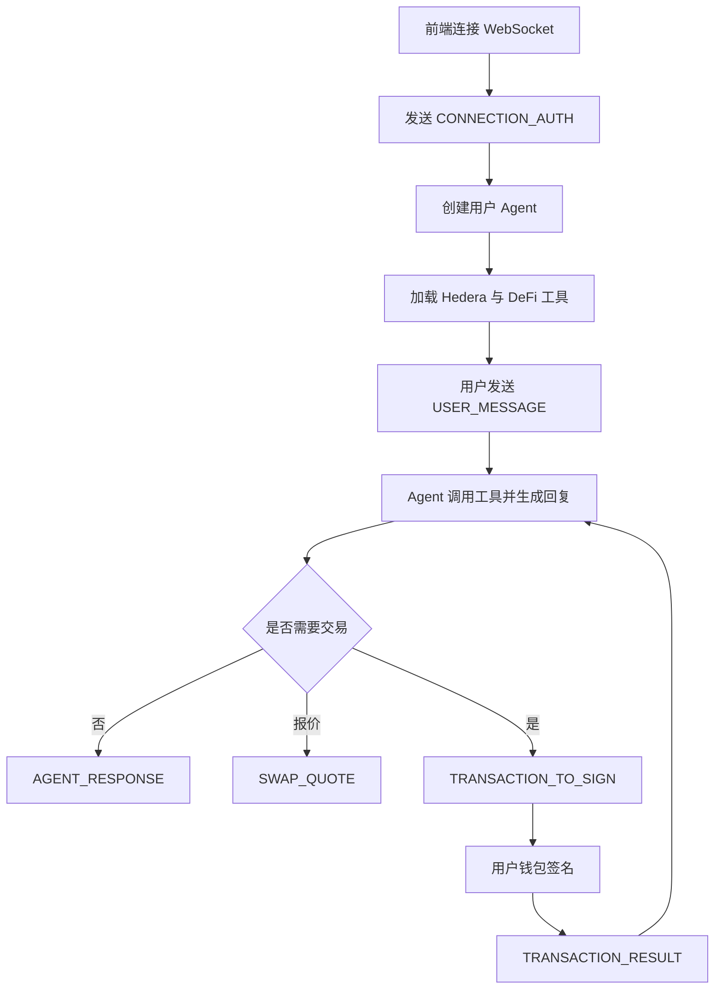

# 网络配置

前端通过 `VITE_HEDERA_NETWORK` 选择网络：

- `mainnet`
- `testnet`
- `previewnet`

本地开发建议使用：

```env
VITE_HEDERA_NETWORK=testnet
VITE_WEBSOCKET_URL_LOCAL=ws://localhost:8080
```

切换网络后需要重启 Vite dev server。`],

  ['Hedron/README.md', String.raw`# Hedera DeFi AI Agent

Hedron 是一个面向 Hedera DeFi 生态的 AI Agent。它通过 WebSocket 与前端通信，集成 Hedera 原生工具、Bonzo Finance、SaucerSwap、Infinity Pool 和 AutoSwapLimit，帮助用户用中文完成查询、策略分析、swap 报价、限价单和待签交易准备。

## 相关仓库
- Frontend: https://github.com/rofergon/Hedron_Frontend
- AutoSwapLimit Contract: https://github.com/rofergon/AutomationSwapLimit

## 已部署合约
- MockPriceOracle: https://hashscan.io/testnet/contract/0.0.6506125
- AutoSwapLimit: https://hashscan.io/testnet/contract/0.0.6506134

## 核心能力
- `::HEDERA::` Hedera：账户查询、余额、HBAR 转账、HTS、HCS
- `::BONZO::` Bonzo Finance：借贷市场、账户 dashboard、HBAR 存入
- `::SAUCERSWAP::` SaucerSwap：DEX 统计、swap 报价、swap 执行、farm、Infinity Pool
- `::AUTOSWAPLIMIT::` AutoSwapLimit：限价单创建与订单查询

## WebSocket 流程


## 消息类型
| Type | 方向 | 用途 |
| --- | --- | --- |
| `CONNECTION_AUTH` | Client -> Agent | 用账户 ID 认证 |
| `USER_MESSAGE` | Client -> Agent | 用户问题或指令 |
| `AGENT_RESPONSE` | Agent -> Client | Agent 文本回复 |
| `SWAP_QUOTE` | Agent -> Client | 结构化 swap 报价 |
| `TRANSACTION_TO_SIGN` | Agent -> Client | 需要钱包签名的交易 bytes |
| `TRANSACTION_RESULT` | Client -> Agent | 签名与执行结果 |
| `SYSTEM_MESSAGE` | Agent -> Client | 系统消息和错误 |

## 本地启动
```bash
cd typescript
npm install
cd examples/langchain
npm install
npm run start:websocket
```

健康检查：
```bash
curl http://localhost:8080/health
```

## 常用环境变量
```env
OPENAI_API_KEY=your-openai-key
HEDERA_NETWORK=testnet
LLM_MODEL=gpt-5-mini
LLM_MAX_TOKENS=12000
MEMORY_MAX_TOKEN_LIMIT=8000
FORCE_CLEAR_MEMORY=false
SAUCERSWAP_MAINNET_API_KEY=your-key
SAUCERSWAP_TESTNET_API_KEY=your-key
```

## 交易安全
Agent 不持有用户私钥。真实链上操作会返回 `TRANSACTION_TO_SIGN`，由前端钱包签名，再通过 `TRANSACTION_RESULT` 告知后端。

## 开发入口
- `typescript/examples/langchain/websocket-agent.ts`
- `typescript/examples/langchain/handlers/connection-manager.ts`
- `typescript/examples/langchain/handlers/message-handlers.ts`
- `typescript/src/shared/tools/defi/`
